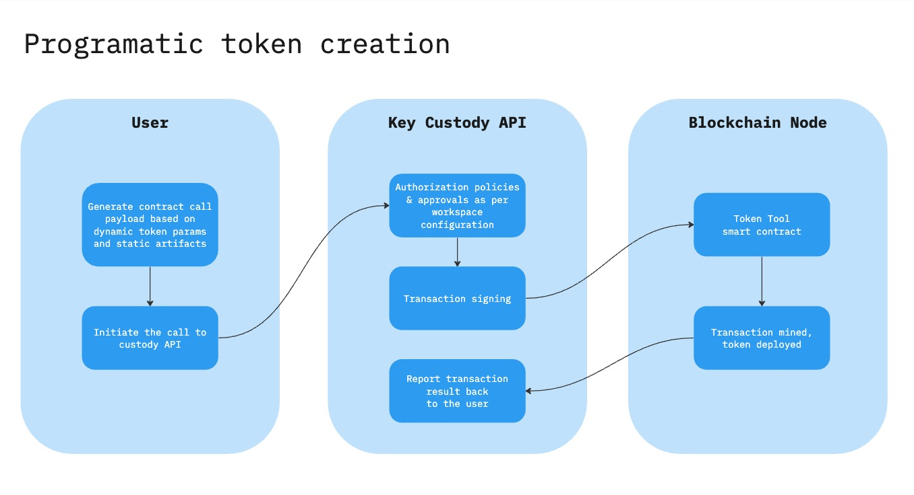

# Bitbond Token Tool API examples
This repository contains a suite of script samples that demonstrate how to
programmatically interact with Bitbond Token Tool contracts on **EVM chains**. Refer to [Token Tool product documentation](https://docs.bitbond.com/asset-tokenization-suite/token-tool/intro-token-tool) for additional context.

Contents by key custody provider:
* [Fireblocks](./fireblocks/evm/README.md)
* [Ripple Custody (formerly Metaco Harmonize)](./metaco/evm/README.md)
* [Local key](./local-key/evm/README.md) (*basic illustration only*)
* [Solana (Local key)](./local-key/solana/README.md) (*basic illustration only*)
* [Stellar — Classic & Soroban (Local key)](./local-key/stellar/README.md) (*basic illustration only*)

The examples in this directory can be adapted to different key custody providers.
Those scripts are intended as a simple illustration of interaction with smart contract's API, for production use we strongly advise employing a secure key custody solution.

For example, key custody SDK can be utilized to execute transactions. For key custodians that do not offer a dedicated SDK, it is often possible to achieve similar outcomes by directly utilizing key custodian’s API. The typical process involves invoking the contract call endpoint of key custodian’s API and passing the calldata payload. This sequence facilitates the creation of a signed transaction that is prepared for transmission to the blockchain node, a step that numerous key custody providers automate. In the case of token deployment, the logic is executed by Token Tool smart contract, resulting in the deployment of the token.

The example uses TypeScript, but can also be converted to pure
JavaScript by removing type definitions.

Example token deployment: [Block explorer](https://sepolia.etherscan.io/tx/0xd7540a7025fc47dc4ebf3168b8de7384e613f71c3f6448b5af22767e9d4e938c)

## Requirements
Recommended:
- Node.js 22.11.0 or higher
- yarn 1.22.0 or higher

## Setup
Please refer to relevant README depending on your key custodian of choice, or to `local-key` directory to get going with the most basic example with private key stored locally.
