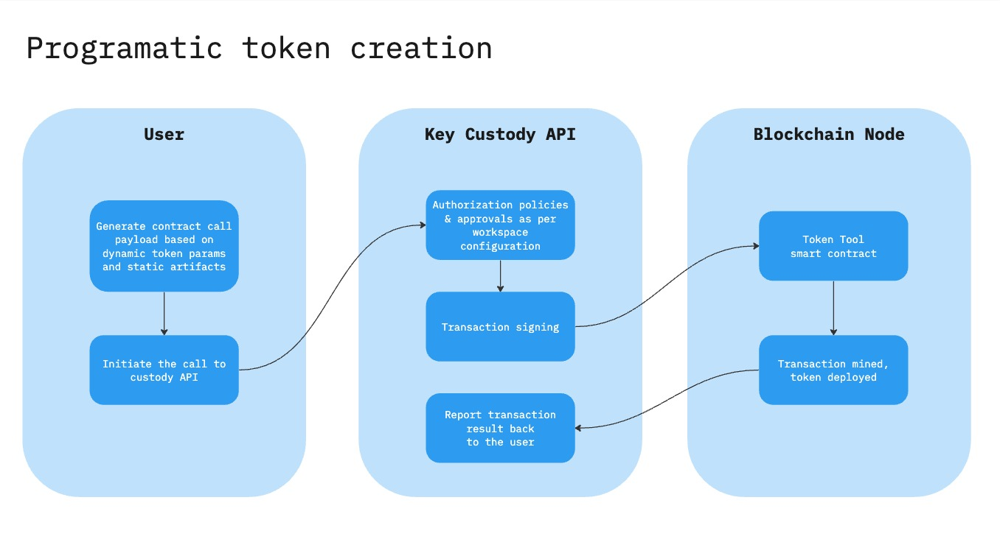

# Bitbond Token Tool x Metaco Harmonize
This directory contains a suite of script samples that demonstrate how to
programmatically interact with Bitbond Token Tool contracts. Refer to [Token Tool product documentation](https://docs.bitbond.com/asset-tokenization-suite/token-tool/intro-token-tool) for additional context.

Metaco integration examples demonstrate how the key custody API can be utilized to execute transactions. The typical process involves invoking the contract call endpoint of Harmonize API and passing the calldata payload. This sequence facilitates the creation of a signed transaction that is prepared for transmission to the blockchain node. In the case of token deployment, the logic is executed by Token Tool smart contract, resulting in the deployment of the token.

## API / UI
Examples below illustrate programatic mode of interaction that is best suited for large scale operations. The same actions at a smaller scale can be convinietly executed using either Token Tool UI connected to Harmonize through Wallet Connect, or Harmonize UI itself.

Example token deployment: [Block explorer](https://mumbai.polygonscan.com/tx/0xd366367005e841cc97e0ffd02002114dfae41222559116b54f56298d45bf057d)



## Requirements
Recommended:
- Node.js 18.16.0 or higher
- npm 9.5.1 or higher

## Setup
1. Install [Node.js](https://nodejs.org/en) and [npm](https://npmjs.com).
Exact installation steps depend on the platfrom, please refer to the documentation for instructions.
1. Install node packages:
```
npm install
```
Follow Harmonize setup instructions to create an API user.

## Token lifecycle actions

### Deploying new token

1. Customize configuration in `deployToken.ts`.
1. To generate the bytecode that will be used for token deployment run:
```
npx ts-node deployToken.ts
```
3. Follow [Harmonize documentation](https://docs.metaco.cloud/) to create an `v0_CreateTransactionOrder` intent type passing the generated bytecode as the data to execute. The destination of that smart contract call should be **Token Tool factory address** provided by Bitbond.

### Transferring tokens

1. Customize transfer parameters in `transferTokens.ts`.
1. To generate bytecode required for transfer run:
```
npx ts-node ./transferTokens.ts
```
3. Follow [Harmonize documentation](https://docs.metaco.cloud/) to create an `v0_CreateTransactionOrder` intent type passing the generated bytecode as the data to execute. The destination of that call should be address of previously deployed **smart contract of the token**.

### Minting tokens

1. Customize minting parameters in `<key-custody>/mintTokens.ts`.
1. To mint the tokens run:
```
npx ts-node ./mintTokens.ts
```
3. Follow [Harmonize documentation](https://docs.metaco.cloud/) to create an `v0_CreateTransactionOrder` intent type passing the generated bytecode as the data to execute. The destination of that call should be address of previously deployed **smart contract of the token**.

### Burning tokens

1. Customize burning parameters in `burnTokens.ts`.
1. To burn the tokens run:
```
npx ts-node ./burnTokens.ts
```
3. Follow [Harmonize documentation](https://docs.metaco.cloud/) to create an `v0_CreateTransactionOrder` intent type passing the generated bytecode as the data to execute. The destination of that call should be address of previously deployed **smart contract of the token**.
